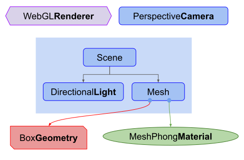

# Three.js 基础

代码目录请参考 [demo 目录](../demo)，并按照数字升序阅读

* [1.js - 基础的立方体图像](../demo/src/1.js)
* [2.js - 光源 & 多个立方体图像](../demo/src/2.js)
* [3.js - 响应式涉及](../demo/src/3.js)

首先先要清楚 `Three.js` 的应用结构，如下图所示：

* 首先最核心的就是渲染器 `Renderer`，我们几乎所有的 3D 对象，属性等都会包含于此，其中最基础也就是场景 `Scene` 与摄像机 `Camera`。
* 其中一个场景图包含了一个场景 `Scene`，各种网格 `Mesh` 对象，光源 `Light` 对象，群组 `Group`，三维物体 `Object3D` 和摄像机 `Camera` 对象。你可以注意到其中 `Camera` 不一定需要在场景图中起作用。

## 三维坐标系

在继续下一个话题前，我们先了解一下在 `Three.js` 中三维坐标系是怎么样的。它与我们印象中的三维坐标系不太一样，等于是沿着 X 轴逆时针旋转 90 度，也就是变成 Z 轴是垂直与我们的，Y 轴是垂直朝上的。如下图所示：

## 视锥

视椎(frustum)是指一个像被削去顶部的金字塔形状。换句话说，可以把"视椎(frustum)"想象成其他三维形状如球体、立方体、棱柱体、截椎体。

视椎体内部的物体将被绘制，视椎体外的东西将不会被绘制。

## 摄像机位置

## 引入光源

## 多个 3D 对象

