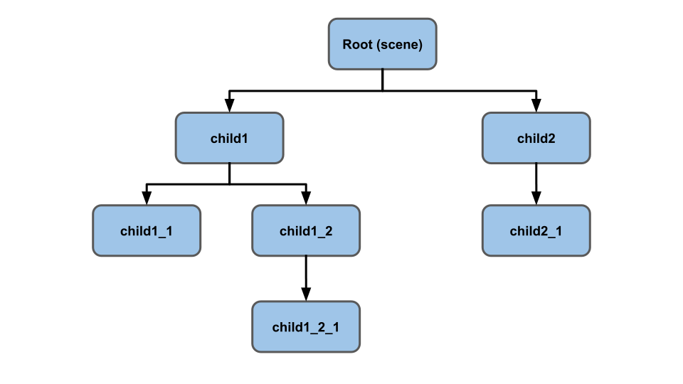
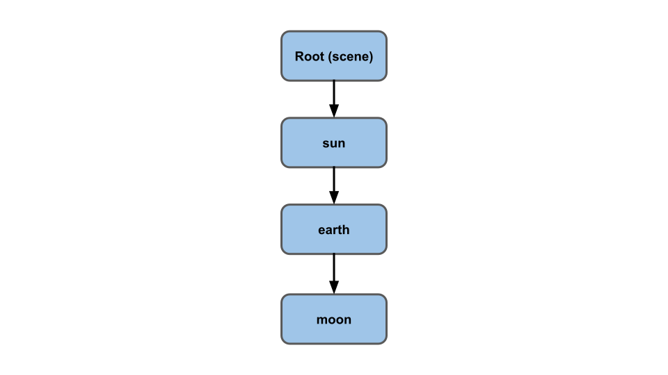
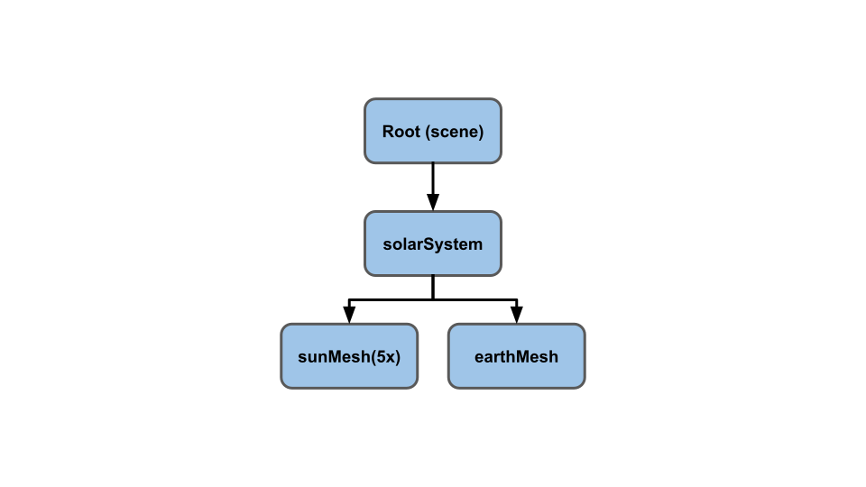
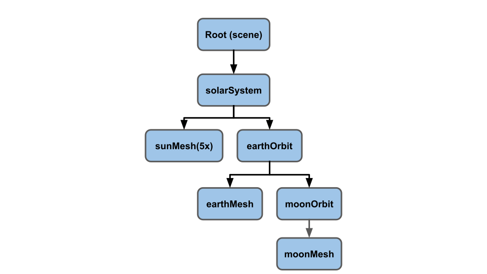
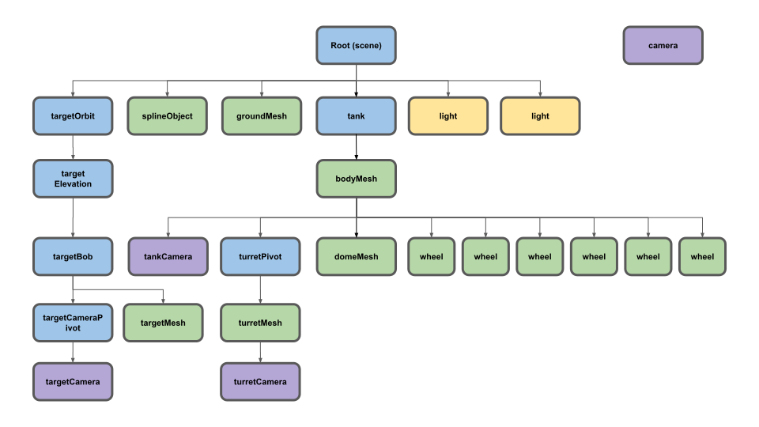

# 场景图

* [5.js - 太阳系](../demo/src/5.js)
* [6.js - 坦克运动模型](../demo/src/6.js)

`Three.js` 最重要的核心就是它的场景图（Scene Graph)。场景图就如同一个树的层级结构，每个节点都代表了一个局部空间。如下图所示：

我们举个太阳系的例子来加深理解：

太阳与地球

引入太阳系

完善太阳系

## 坦克运动模型

