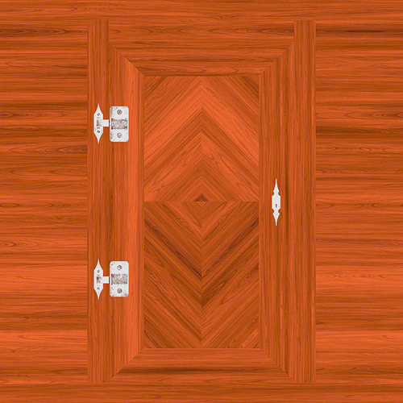
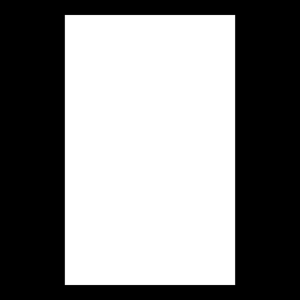
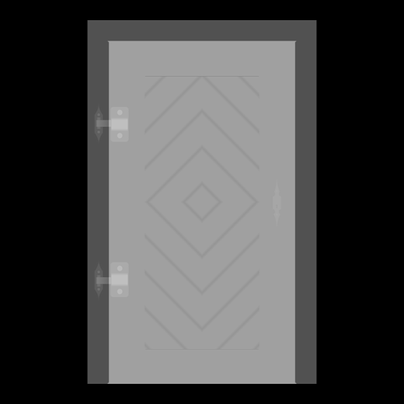
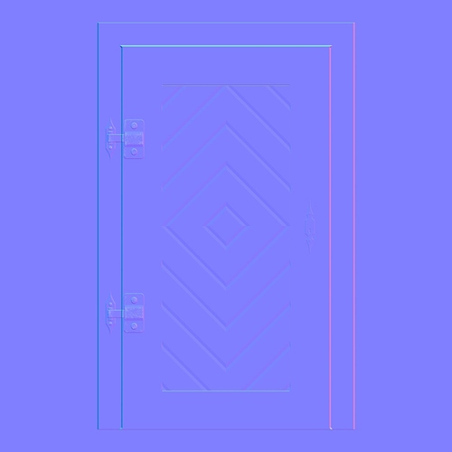
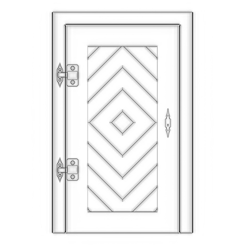
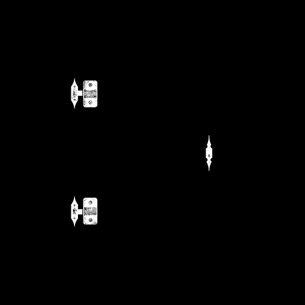

# Three.js Journey

学习内容：

* 了解 `three.js` 是什么
* 绘制第一个场景、添加绘制对象、选择合适的材质、添加纹理及动效
* 自定义几何体、添加光源及阴影、添加 3D 模型交互、添加粒子效果
* 应用物理规则、呈现真实渲染、编写自定义 `shader`、预处理绘制对象、使用 `Blender` 来建模

## 什么是 `WebGL`，为什么要使用 `three.js`

`WebGL` 实际上就是 `OpenGL ES` 的封装，而 `OpenGL ES` 是 `OpenGL` 的子集；同时 `WebGL` 也是 `JavaScript` 的一种 `API`，因为借助了 GPU 的特性，它能在 `canvas` 中能以一种非常可观的速度渲染图像。

在 `WebGL` 中我们只能通过组合大量的点，线与三角形来组合图像；假设我们需要绘制个 3D 模型，这个模型由 1000 个三角形组合而成，一个三角形救有三个点，那么就有 3000 个点需要我们去处理。但好在 GPU 处理图形时是并行的，可以同时处理这 3000 个点；只要你的 GPU 越强大，每秒能处理的数据就越多。

使用 `WebGL` 来编写代码绘制图形，我们首先需要编写着色器 `Shader`（要掌握 `Shader` 并不简单，需要有一定的图形学基础及 `C/C++` 基础），然后我们需要组织数据提供给着色器，譬如点在坐标系具体的位置，像素点的颜色属性等等（主要涉及线性代数）。

要用 `WebGL` 来绘制一个三角形可能都需要编写上百行的代码才能实现。这也就是为什么原生 `WebGL` 难以上手，门槛也比较高，但也因为它更加接近底层，所以它在图形渲染上的性能才如此优秀。

`Three.js` 简单来说就是 `WebGL` 的封装，同时它还可以创建 `SVG` 和 `CSS` 图形，它为开发者带来了更加便利方式来实现各种复杂的 3D 图形动效。例如上面说的绘制个三角形，使用 `Three.js` 只需要几行代码即可完成。这也就是我们为什么需要用 `Three.js`。

## 初次尝试

这里我们简单绘制一个立方体，具体代码参考 [1.js](./demo/src/1.js)

## 简单动效

在 `Three.js` 中所有 3D 实例都会继承顶层类 `Object3D`，因此也都拥有 `position`，`rotation`、`scale` 等属性；我们所实现的动效基本都是通过变换这些属性值来完成的。

具体代码参考 [2.js](./demo/src/2.js)

## 控制摄像机

大多 3D 场景都支持鼠标控制摄像机，这里我们也简单支持一下。具体代码参考 [3.js](./demo/src/3.js)

## 调整尺寸大小

在一些特殊情况下，我们的浏览器需要进行尺寸缩放，这时候我们的画布也应该做到响应式。特别要注意的是，我们不能简单的更新 `canvas` 的尺寸，`Three.js` 中的某些对象的尺寸也需要同步更新。

具体代码参考 [4.js](./demo/src/4.js)

## 几何体结构 `Geometry`

几何体结构提供了一个 3D 模型的基础结构，在 `Three.js` 为我们提供了许多种几何体结构，具体可以参考官方的文档介绍。不过在我们的日常开发中，经常会遇到需要自己定义几何体结构，这里我们简单介绍一下如何编写自己的几何体结构

这里我们首先介绍 `THREE.Geometry` 类的使用，但在自己编写几何体的时，为了追求性能上的极致，我们通常会用 `BufferGeometry` 来编写，因为 `Buffer` 对象的内存是由 `C++` 层面来申请的，它更加接近底层，所以性能会更好。

`Buffer` 对象时 `JavaScript` 中 `Unit8Array` 的子类，我们可以暂时把它当成简单的数组即可。

具体代码参考 [5.js](./demo/src/5.js)

## `dat.GUI`

在我们的开发过程中，很多时候需要调整各种变量参数，如果每次都是改代码，那么效率就会低很多。因此我们需要借助工具来解决这个问题。

这里需要注意一点，在 `three.js` 中，对象的颜色都是通过 `Color` 类来设置的；但我们使用 `dat.gui` 的 `addColor` 方法时，只能获取颜色的十六进制数，同时我们无法直接改变材质的颜色；因此我们通过监听另外一个颜色变量的变化来设置材质的颜色。

具体代码参考 [6.js](./demo/src/6.js)

## 纹理 `Texture`

纹理是什么呢？纹理就是覆盖在几何体结构 `Geometry` 上的图像。我们之前接触到的纹理都是简单的颜色纹理，在实际的开发过程中我们需要更多多样化的纹理，不同类型的纹理在呈现上也有不同的效果，不仅仅是颜色上的差异。下面我们来认识几种典型的纹理类型：

* ***albedo texture*** 是最简单的一种，它只会将纹理的像素并作用于几何体结构上



* ***alpha texture*** 是一种灰度图像，在其中白色可见，黑色的则不可见



* ***height texture*** 是一种灰度图像，它还包含了一些高度信息，这些高度信息可以辅助我们将图像的呈现变得更加接近自然、真实



* ***normal texture*** 是一种模拟凹凸处光照效果的技术，可以在不添加多余的顶点的情况下，展现更多的细节，因此它的性能也非常优异。同时还可以模拟不同角度查看图形时，光照效果也不一样



* ***ambient occlusion*** 是一种灰度图像，用于计算场景中每个顶点是如何接受环境光的，这种贴图并不能展示真实的阴影情况，但能形成明显对比，增强层次感



* ***metalness*** 是一种灰度图像，白色部分表示这部分为金属，黑色为非金属；这些信息有助于生成光线反射



* ***Roughness*** 是一种带有金属性质的灰度图像，白色部分表示这部分为粗糙的，黑色为光滑的。这些信息有助于消除散光

上述这些贴图都遵循 `PBR - Physically Based Rendering` 基于物理的渲染，相关内容比较深奥，下面仅提供参考资料阅读：

* [basic-theory-of-physically-based-rendering](https://marmoset.co/posts/basic-theory-of-physically-based-rendering)
* [physically-based-rendering-and-you-can-too](https://marmoset.co/posts/physically-based-rendering-and-you-can-too)

### 如何加载纹理

在 `JavaScript` 中我们有 `Image` 类来实现贴图的加载，不过在 `Three.js` 中提供了 `TextureLoader` 类，更方便我们的贴图加载处理；并且还提供了 `LoadingManager` 类辅助我们更好地管理加载贴图

```js
const image = new Image()
image.onload = () => {
  console.log('image loaded')
}
image.src = 'http://xxx.com/xxx.jpg'

const textureLoader = new THREE.TextureLoader()
const texture = textureLoader.load(
  'texture/door/color.jpg',
  () => {
    console.log('loading finished')
  },
  () => {
    console.log('loading progressing')
  },
  () => {
    console.log('loading error')
  }
)

const loadingManager = new THREE.LoadingManager()
loadingManager.onStart = () => {
  console.log('loading started')
}

loadingManager.onLoaded = () => {
  console.log('loading finished')
}

loadingManager.onProgress = () => {
  console.log('loading progressing')
}

loadingManager.onError = () => {
  console.log('loading error')
}

const textureLoader = new THREE.TextureLoader(loadingManager)
```

具体代码参考 [7.js](./demo/src/7.js)

纹理相关的内容比较多，这里暂时不展开描述，许多的 3D 建模软件也能很好的辅助我们使用纹理，后续再继续补充纹理相关应用。
